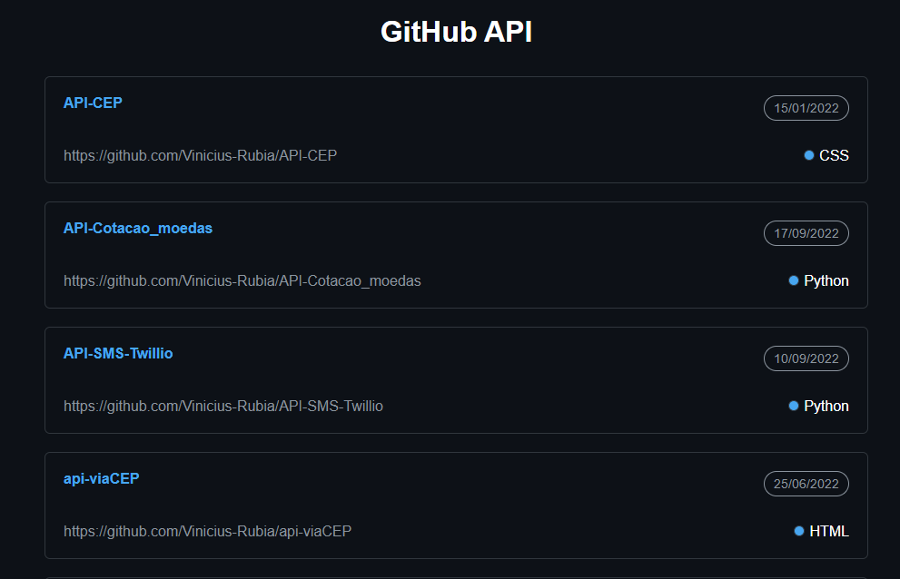

# Consumindo API do GitHub

---

Este projeto consiste em consumir a API do GitHub usando fetch juntamente do JSON para conseguir puxar as iformações. As informações que foram puxadas da API foram:

- Nome do Resositório
- Data de Criação
- Link do Repositório
- Linguagem com maior Relevância